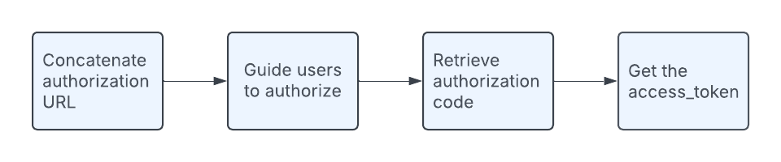
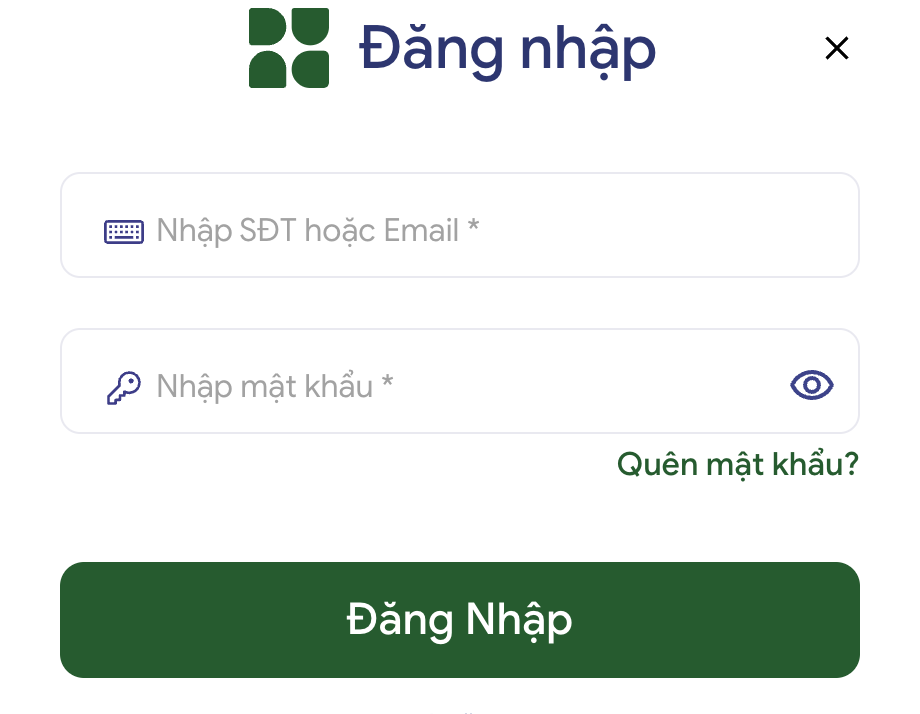
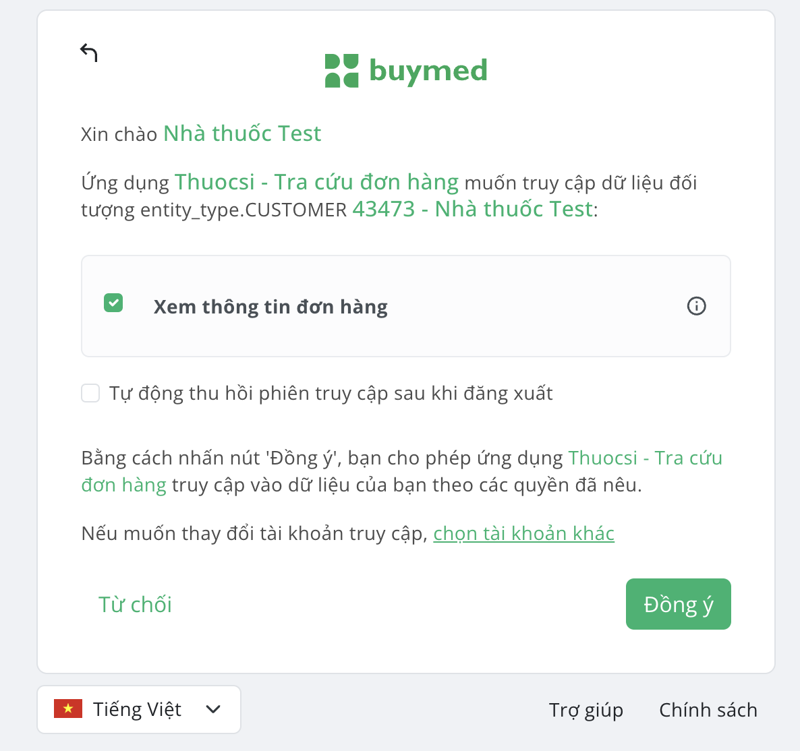

# 🔐 Authentication/Authorization

## 📋 Overview

If your application needs to access the business data of Buymed sellers (like product and order information) through Buymed Open Platform, you need to get the authorization from sellers, that is, the "Access Token" required for accessing the sellers' data. You need to guide the sellers to complete the flow of "using Buymed seller account to log in and authorize the application". This process uses the international OAuth2.0 standard protocol for user authentication and authorization.

Buymed Open Platform adopts the "Code for token" mode, described as follows.

## 🌐 Domains

### 🔑 Auth Domain
The Auth Domain is the domain used for authorization. It is where clients obtain access tokens to authenticate their requests.

**Auth Domain Values by Region:**

| Environment | Service Region | Auth Domain | Status |
|------------|---------------|-------------|---------|
| Production | Vietnam (VN) 🇻🇳 | https://sso.thuocsi.vn<br/>https://thuocsi.vn<br/>https://sso.buymed.com | ✅ Active |
| Production | Thailand (TH) 🇹🇭 | - | 🔜 Coming Soon |
| Production | Cambodia (KH) 🇰🇭 | - | 🔜 Coming Soon |

### 🚀 Service Domain
The Service Domain is the domain used to call Open APIs. It is where clients send their requests after obtaining an access token.

## 📝 Authorization Steps

The figure below shows the authorization steps:



### 1️⃣ Guide User to Authorize

#### 🔗 Access the Authorization URL
Provide users with the Authorization URL they need to visit. This URL is typically provided by your application and includes parameters like clientID, redirectUri, and scope.

**Example URL:**
```
https://{yourAppType}/oauth/authorize?
    responseType=code&
    clientID={yourClientId}&
    redirectUri={https://yourApp/callback}&
    scope=read_profile,write_data
```

:::note
- The "clientID" and "redirectUri" should be replaced with the ones of your own application
- The "scope" should be replaced with the specific permissions your application requires
:::

**Required Parameters:**

| Parameter | Required | Description |
|-----------|----------|-------------|
| clientID | ✅ Required | Your application's Client ID (provided by Buymed when your app registration is successful) |
| responseType | ✅ Required | Denotes the kind of credential that Buymed will return (code or token). For this flow, the value must be code |
| redirectUri | ✅ Required | The URL to which Buymed will redirect the browser after authorization has been granted. The Authorization Code will be available in the code URL parameter |
| scope | ✅ Required | List of permissions that your application requests from the user or the system. Scopes are separated by spaces |

#### 🔄 Authorization Process

1. **Log In to Their Account**

    

    Users will be redirected to the platform's login page. Instruct them to log in using their credentials.

2. **Review the Permissions**

    After logging in, users will see a screen listing the permissions (scopes) your application is requesting. Explain what each permission means and why it's necessary.

    **Example Permissions:**
    - 📖 Read Profile: Allows your app to view the seller's profile information
    - ✏️ Write Data: Allows your app to update or modify data on seller's behalf

3. **Grant Authorization**

    

    Users will be presented with a consent screen showing:
    - The name of your application (as registered with the OAuth provider)
    - The specific permissions (scopes) your application is requesting
    - A description of what these permissions allow your application to do
    - Options to "Đồng ý" (Allow) or "Từ chối" (Deny) access

#### What Happens Next

**If user clicks "Đồng ý" (Allow):**
- The OAuth provider generates an authorization code
- User is redirected to your redirectUri with the code
- Example: `https://yourApp/callback?code={auth_code}`
- Your application can then exchange this code for an access token

**If user clicks "Từ chối" (Deny):**
- No authorization code is generated
- User is redirected with an error parameter
- Example: `https://yourApp/callback?error=access_denied`
- Your application should handle this error gracefully

### 2️⃣ Handle Authorization Response

All responses follow this format:
```json
{
  "status": "OK",
  "message": "Success",
  "data": [],
  "errorCode": null
}
```

**Response Data Fields:**

| Name | Description | Example |
|------|-------------|---------|
| accessToken | 🔑 A string token used to authenticate and authorize access | "eyJhbGciOiJIUzI1NiIsInR5cCI6IkpXVCJ9..." |
| expiresIn | ⏱️ Token expiration time in seconds | 3600 (1 hour) |
| scope | 📋 Permissions granted to the token | "pharmacy:orders:read" |
| tokenType | 🏷️ Usually "Bearer" for accessing resources without additional credentials | "Bearer" |

### 3️⃣ Retrieve Authorization Code

After authorization, the platform will redirect the seller back to your application's Redirect URI with an authorization code:
```
https://yourapp.com/callback?code=AUTH_CODE&state=12345
```

The state (12345) parameter is used to maintain security and prevent unauthorized requests.

### 4️⃣ Exchange Code for Access Token

Now that you have an Authorization Code, you must exchange it for tokens using the `/iam/core/v1/oauth` API:

```curl
curl --request POST 'https://api.stg.buymed.tech/iam/core/v1/oauth/token' \
--header 'Content-Type: application/json' \
--data '{
    "code":{AUTH_CODE},
    "clientId": {yourClientID},
    "clientSecret": {yourClientSecret},
    "grantType": "authorization_code"
}'
```

**Parameters:**

| Parameter | Required | Description |
|-----------|----------|-------------|
| clientID | ✅ Required | Your application's Client ID (provided by Buymed-SSO) |
| clientSecret | ✅ Required | Your application's Client Secret (provided by Buymed-SSO) |
| code | ✅ Required | The authorizationCode retrieved in the previous step |
| grantType | ✅ Required | Must be "authorization_code" for this flow |

**Response Example:**
```json
{
    "status": "OK",
    "message": "Get token successfully (grantType: authorization_code)",
    "data": [
        {
            "accessToken": "eyJ0eXBlIjoiYWNjZX...",
            "expiresIn": 432000,
            "refreshToken": "eyJ0eXBlIjoiYWNjZX...",
            "rfExpiresIn": 2592000,
            "scope": "pharmacy:orders:read",
            "tokenType": "Bearer"
        }
    ]
}
```

**Response Fields:**

| Field | Description |
|-------|-------------|
| accessToken | The access token issued by the authorization server |
| expiresIn | Token lifetime in seconds |
| refreshToken | Token used to obtain new access tokens |
| rfExpiresIn | Refresh token lifetime in seconds |
| scope | Granted permissions |
| tokenType | Access token type |

:::note
The access token will expire in a specific period (expiresIn). Before it expires, users do not need to authorize the application again. You need to save the latest token properly.
:::

### 5️⃣ Refresh Token

You can use the Refresh Token to get a new access token when the previous one expires or when gaining access to a new resource.

```curl
curl --request POST 'https://{{ssoDomain}}/backend/iam/core/v1/oauth/token' \
--header 'Content-Type: application/json' \
--data '{
    "refreshToken":{yourRefreshToken},
    "clientId": {yourClientID},
    "clientSecret": {yourClientSecret},
    "grantType": "refresh_token"
}'
```

**Parameters:**

| Parameter | Required | Description |
|-----------|----------|-------------|
| clientID | ✅ Required | Your application's Client ID |
| clientSecret | ✅ Required | Your application's Client Secret |
| grantType | ✅ Required | Must be "refresh_token" |
| refreshToken | ✅ Required | The refresh token from previous response |

## ⚠️ Error Handling

**Common OAuth Authorization Errors:**

| Error | Description |
|-------|-------------|
| ❌ invalid_scope | The requested scope is invalid or not supported |
| ❌ invalid_request | Missing required information or incorrect format |
| ❌ unauthorized_client | The client is not authorized to make this request |
| ❌ unsupported_response_type | The response type is not supported |

## 💡 Best Practices

📘 **Important Guidelines:**
- 🗣️ Clear Communication: Ensure the consent screen clearly explains permissions
- 🔄 User Control: Allow users to easily revoke permissions
- 🛠️ Error Handling: Implement robust error handling for denials and issues
- 🔒 Token Storage: Store tokens securely
- 🔄 Token Refresh: Implement proper token refresh logic

---

Need help with authentication? Contact our support team at [developer@buymed.com](mailto:developer@buymed.com) 